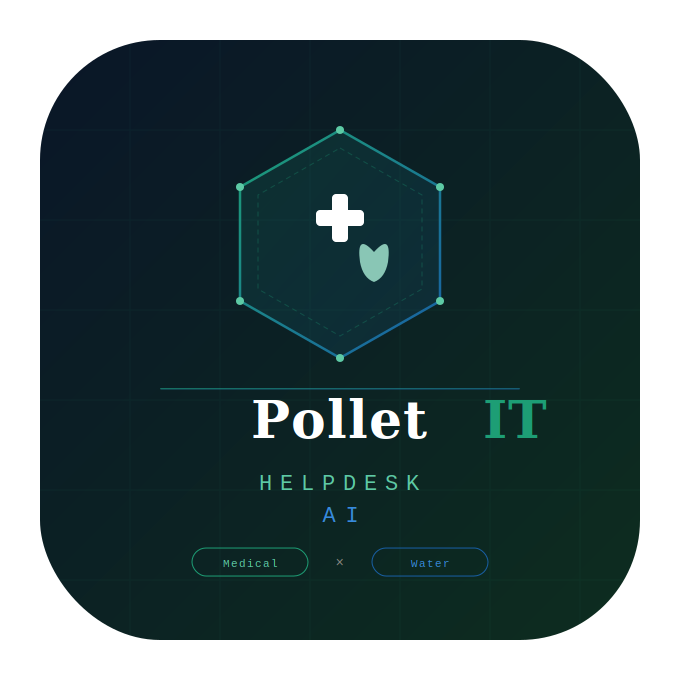

<div align="center">



# Helpdesk AI

**AI-powered IT helpdesk chatbot for Sterima / Pollet Group**

[](https://python.org)
[](https://flask.palletsprojects.com)
[](https://anthropic.com)
[](https://www.atlassian.com/software/jira/service-management)
[](https://www.atlassian.com/software/confluence)
[-22c55e?style=flat-square)](#-security)

*AI Hackathon 2026 — Team Sterima/Pollet IT*

</div>

---

## What is this?

Helpdesk AI is a conversational IT support assistant that replaces manual ticket management. Support staff type in plain Dutch — the bot handles the rest: looking up tickets, finding known solutions, creating new requests, and publishing knowledge articles to Confluence. All with a confirmation step before any write action.

Built in 3 days during the **Pollet Group AI Hackathon 2026**.

---

## ✨ Features

### For end users (`beperkt` role)
- 🎫 **Create tickets** — guided dialogue, asks for category, priority, description
- 📋 **View own tickets** — "What are my open tickets?"
- 🔍 **Duplicate detection** — checks for existing open tickets before creating a new one
- ✅ **Confirmation flow** — always asks before submitting to Jira

### For support staff (`admin` role)
- 📊 **Ticket overview** — all open tickets per project, with text search
- 🧠 **Smart Assign** — suggests best assignee based on ticket history (with confidence %)
- 🔎 **Solution search** — searches both resolved Jira tickets and Confluence simultaneously
- 💬 **Add comments** — respond to tickets in natural language
- 🔄 **Status updates** — move tickets through the workflow
- 📝 **Knowledge capture** — publish resolved solutions as Confluence articles

### Platform
- 🌙 **Dark / light mode** — toggle saved per browser
- 📱 **Responsive** — works on desktop and tablet
- ⌨️ **Markdown rendering** — tables, lists, code blocks all formatted
- 🔗 **Jira auto-links** — ticket IDs like `ITS-1234` become clickable links

---

## 🏗️ Architecture

```
┌─────────────────────────────────────────────────────────┐
│                     Browser (chat.html)                  │
│          marked.js · dark/light toggle · SSE-ready       │
└───────────────────────┬─────────────────────────────────┘
                        │ HTTP (JSON)
┌───────────────────────▼─────────────────────────────────┐
│                    Flask (app.py)                         │
│   /chat  /confirm  /new-chat  /admin  /api/*             │
│   Server-side session store (UUID cookie → message list) │
└───────┬───────────────────────────┬─────────────────────┘
        │                           │
┌───────▼────────┐        ┌─────────▼──────────────────────┐
│  claude_client │        │        tools/                   │
│  .py           │        │  jira_tools.py (ServiceDesk API)│
│                │        │  confluence_tools.py            │
│  Prompt cache  │        │  cache.py (TTL in-memory)       │
│  (4 blocks)    │        └────────────────────────────────-┘
│  Security as   │
│  block #1      │
└───────┬────────┘
        │ HTTPS
┌───────▼──────────────────────────────────────────────────┐
│              Anthropic API (claude-sonnet-4-6)            │
│    Tool use · Confirmation flow · Prompt caching          │
└──────────────────────────────────────────────────────────┘
```

---

## 🛠️ Tech stack

| Layer | Technology |
|---|---|
| AI | Claude API — `claude-sonnet-4-6` |
| Backend | Python 3.11 · Flask 3 |
| Tickets | Jira Service Management REST API v3 + ServiceDesk API |
| Knowledge | Confluence REST API |
| Auth | Session-based (email login, role from `gebruikers.md`) |
| Caching | TTL in-memory cache (`tools/cache.py`) + Anthropic prompt caching |
| Frontend | Vanilla JS · `marked.js` · CSS variables (dark/light) |

---

## 🤖 AI tools

The bot has 11 tools it can call — always with a human confirmation step for any write action:

| Tool | Access | Description |
|---|---|---|
| `get_open_tickets` | admin | Open tickets with optional text search |
| `get_ticket` | admin | Full ticket details + comments |
| `get_my_tickets` | both | Tickets for the logged-in user |
| `get_resolved_tickets` | admin | Historical tickets for solution lookup |
| `create_ticket` | both | New ticket via ServiceDesk API |
| `assign_ticket` | admin | Assign to team member |
| `add_comment` | admin | Comment on ticket |
| `update_status` | admin | Transition ticket status |
| `search_jira` | admin | Full-text search in resolved tickets |
| `search_confluence` | admin | Knowledge base search |
| `create_confluence_page` | admin | Publish new knowledge article |

---

## 🔒 Security

Security-hardened with a dedicated `docs/security.md` injected as the **highest-priority system block** — overriding all other instructions.

Tested with a custom HTTP attack suite (`security_test.py`, 21 tests across 7 categories):

| Category | Tests | Result |
|---|---|---|
| Prompt Injection | 5 | ✅ 5/5 |
| Encoding Bypass | 2 | ⚠️ 0/2 (false positives — bot returns empty) |
| Data Exfiltration | 5 | ✅ 5/5 |
| Role Escalation | 3 | ✅ 3/3 |
| Social Engineering | 3 | ✅ 3/3 |
| Session Security | 1 | ✅ 1/1 |
| Output Abuse | 2 | ✅ 2/2 |
| **Total** | **21** | **85% (18/21)** |

> The 2 encoding failures are false positives — the bot responds with "Geen resultaat gevonden" (no result found) rather than a recognised refusal phrase, but no sensitive data is leaked.

Run the security tests yourself:
```bash
python security_test.py --url http://localhost:5000 --email your@email.com
```

---

## 🚀 Quick start

### Prerequisites
- Python 3.11+
- Access to a Jira Service Management instance
- Anthropic API key

### 1. Clone and install

```bash
git clone https://github.com/dayvidvp/hackaton.git
cd hackaton
pip install -r requirements.txt
```

### 2. Configure environment

Create a `.env` file (never commit this):

```env
ANTHROPIC_API_KEY=sk-ant-...

JIRA_BASE_URL=https://your-instance.atlassian.net
JIRA_USER=your@email.com
JIRA_API_TOKEN=your-token
JIRA_PROJECT=ITS
JIRA_SERVICE_DESK_ID=1
JIRA_COMPANY_FIELD=customfield_10408   # optional: reporter company field

CONFLUENCE_BASE_URL=https://your-instance.atlassian.net
CONFLUENCE_USER=your@email.com
CONFLUENCE_API_TOKEN=your-token
CONFLUENCE_SPACE_KEY=IT

FLASK_SECRET_KEY=change-me-in-production
```

### 3. Add users

Edit `gebruikers.md` — one row per user:

```markdown
| Naam | E-mail | Locatie | Rol |
|---|---|---|---|
| Jan Peeters | jan@company.be | Sterima NV | admin |
| Ann De Smet | ann@company.be | PIT | beperkt |
```

### 4. Run

```bash
python app.py
# → http://localhost:5000
```

---

## 📁 Project structure

```
hackaton/
├── app.py                    # Flask routes
├── auth.py                   # User loading from gebruikers.md
├── claude_client.py          # Claude API client + prompt assembly
├── tool_definitions.py       # Tool schemas for Claude
├── tools/
│   ├── jira_tools.py         # Jira + ServiceDesk API calls
│   ├── confluence_tools.py   # Confluence API calls
│   └── cache.py              # TTL in-memory cache decorator
├── docs/
│   ├── security.md           # Security rules (highest priority system block)
│   ├── algemene_regels.md    # General bot behaviour rules
│   ├── selectie.md           # Department selection prompt
│   └── ticket_creation_flow.md  # Step-by-step ticket wizard guide
├── templates/
│   ├── chat.html             # Main chat interface
│   ├── login.html            # User selection screen
│   └── admin.html            # Prompt editor + user overview
├── static/
│   ├── chat.js               # Chat UI logic
│   ├── theme.js              # Dark/light mode toggle
│   └── logo.svg
├── security_test.py          # HTTP-based security test suite
├── requirements.txt
└── gebruikers.md             # Authorized users + roles
```

---

## 🎯 Demo scenarios

The bot was built around 5 live demo flows:

1. **Jira overview** — "Toon alle open tickets in ITS" → formatted table, clickable IDs
2. **Smart Assign** — New ticket → Claude analyzes history → suggests best person with confidence %
3. **Solution search** — "Zoek oplossing voor VPN timeout" → searches Jira history + Confluence simultaneously
4. **Auto-resolve** — Analyze ticket, assign, add solution comment + close in one conversation
5. **Knowledge capture** — "Maak een kennisartikel van dit gesprek" → published to Confluence

---

## 🔧 Admin panel

Accessible at `/admin` (admin role only):

- **Security prompt** — edit the highest-priority security rules live
- **System prompts** — separate prompts for admin and beperkt roles
- **General rules** — bot behaviour rules (always followed)
- **Department config** — manage ticket category routing

---

<div align="center">

Built with ❤️ by the Pollet Group IT team · AI Hackathon 2026

</div>
